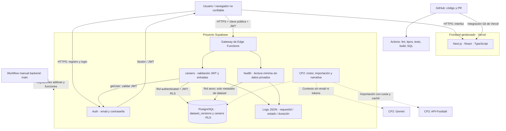
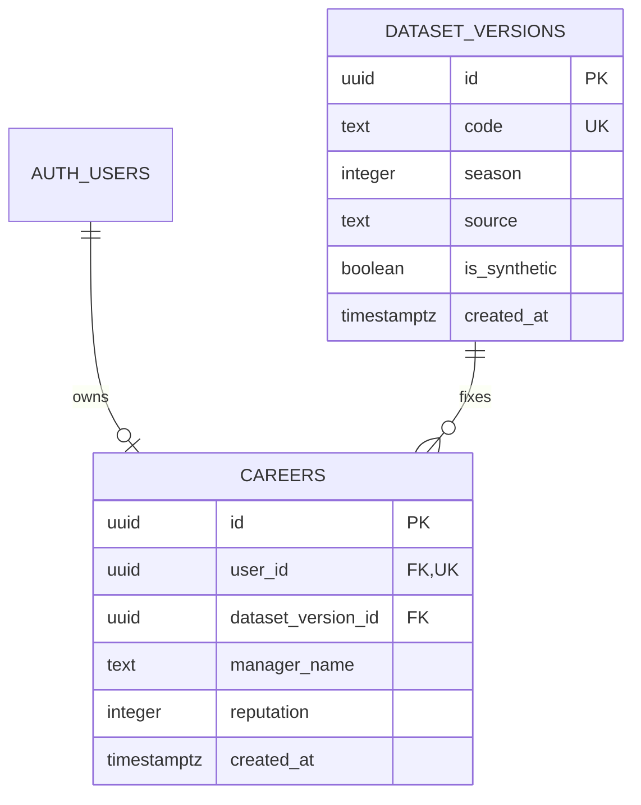

# Arquitectura de Camino a la Gloria

Fecha de diseño: 27/09/2026. Referencias: one-pager, p. 1; TPI, pp. 1–4. Requisito de CP1: TPI, p. 3, sección 5.

## Contexto y objetivos

El producto ofrece una carrera de director técnico desde categorías menores hacia ligas superiores. Combina datos deportivos versionados con un motor de reglas verificables y narrativa contextual generada por IA. El equipo es Julian Coloma, Lucas Modernell y Tomas Rosato.

La primera entrega establece arquitectura y una base ejecutable. El corte vertical implementado es: abrir la web, autenticarse, crear una carrera vinculada a un dataset y recuperarla. La disponibilidad del despliegue se documenta por separado en las evidencias.

## Componentes y límites de confianza

Líneas continuas: código/configuración de CP1. Líneas punteadas: diseño futuro. La existencia de un archivo de workflow no demuestra una ejecución exitosa; consultar las evidencias.

El frontend no contiene credenciales privilegiadas. Las funciones usan la clave pública y el JWT del usuario; PostgreSQL aplica RLS también ante acceso REST directo. CORS limita orígenes de navegador y no reemplaza autenticación. `health` es público y solo devuelve disponibilidad e identificador de solicitud.

## Flujos actuales

1. **Registro:** navegador → Auth → correo de confirmación → sesión. El navegador conserva la sesión mediante el SDK. El backend valida el token con Auth en cada solicitud privada; no confía en `getSession` del cliente para autorizar.
2. **Crear carrera:** validar origen, método y JWT; leer hasta 2 KB; aceptar únicamente `managerName`; buscar versión sintética conocida; insertar con `user_id` del token. La restricción única evita duplicados por reintento concurrente y produce HTTP 409.
3. **Recuperar carrera:** usuario autenticado → función → consulta filtrada por propietario y RLS → como máximo una carrera.
4. **Salud:** solicitud explícita → función → lectura de la versión de dataset → 200/503. Una portada accesible por sí sola no prueba disponibilidad del backend.

## Datos implementados

El índice único de `user_id` sirve también para búsqueda de la carrera. El dataset inicial no contiene nombres, jugadores ni estadísticas reales. No se duplican perfiles hasta que el producto necesite atributos adicionales a Auth y al nombre del director técnico.

Modelo previsto para CP2: `competitions`, `clubs`, `players`, `rosters`, `fixtures`, `match_results`, `offers` y `narrative_events`. `rosters` une jugador/club/dataset. Los resultados y reputación pertenecen a una carrera, separados de los datos reales. Antes de simular se agregará unicidad por carrera/partido y transacción de resultado más avance.

## IA y motor: contrato de evolución

El motor TypeScript será una función de estado + decisión + semilla y devolverá resultado y cambios. Ejecutará reglas en backend; no se acepta un marcador enviado por el navegador. No se incorpora todavía un algoritmo deportivo arbitrario que el equipo no haya validado.

La IA recibirá identificador del partido, resultado ya calculado y hechos autorizados; devolverá `{title, body, matchId}`. El validador inicial está implementado y probado. Rechaza campos adicionales y referencias a otro partido. La validación de esquema no demuestra veracidad del texto: CP2 debe agregar controles de hechos y pruebas de calidad. Ante fallo se usará un resumen determinista del resultado, sin bloquear el juego.

API-Football se consultará durante importaciones controladas, no en cada partido. Guardar origen, fecha, temporada y versión; verificar cobertura y permisos antes de importar nombres/escudos. El proyecto no redistribuye datos reales en CP1.

## Seguridad, disponibilidad y escala

- Privacidad por propietario, restricciones de base y privilegios de inserción limitados. Sin permisos de actualización/borrado para clientes en CP1.
- Confirmación de correo y contraseña mínima de 8 caracteres. CAPTCHA y límites adicionales de abuso quedan para la siguiente etapa antes de apertura masiva.
- Timeouts de 5 s en salud y 8 s por llamada de carreras; errores públicos genéricos; logs sin contraseñas, emails, JWT ni payloads.
- Frontend estático cuando corresponde; funciones sin estado y una sola carrera por usuario para acotar lecturas. La base sigue siendo el punto central; no se promete escalado ilimitado ni SLA del nivel gratuito.
- Objetivos propuestos, no medidos: p95 menor a 2 s para operaciones de carrera en carga académica; menos de 1% de errores inesperados. Validar con una prueba de carga acotada en CP2.
- CP1 usa un único proyecto cloud académico y un entorno local. Separar staging/producción cuando presupuesto y operación lo justifiquen. Realtime, Storage y colas no se aprovisionan sin una necesidad implementada.

## Operación

Logs JSON incluyen `requestId`, función, método cuando corresponde, código HTTP y duración. Revisar errores 5xx y latencia en Supabase; builds en Vercel y CI en GitHub. Las métricas de IA y consumo se agregan al integrar proveedores. No se anuncian alertas automáticas si todavía no están configuradas.

Ante fallo: identificar solicitud; revisar función, Auth y DB; corregir mediante commit y despliegue. Migraciones futuras serán aditivas y revisadas. El usuario prohíbe borrados: no ejecutar resets ni estrategias de rollback que destruyan datos. Una reversión del código debe conservar compatibilidad con el esquema.
