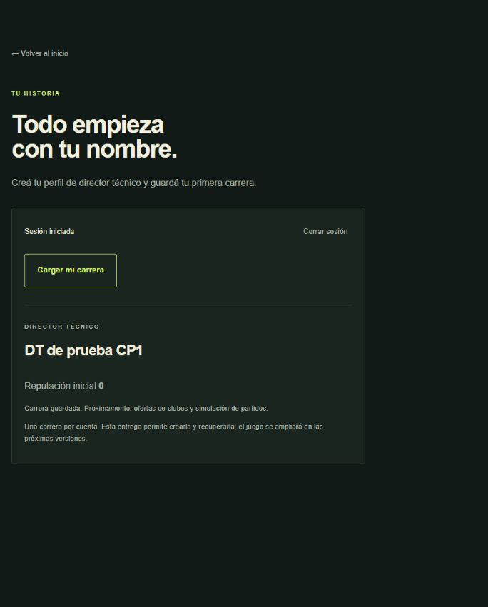

# Evidencia de Checkpoint 1

Fecha de preparación: **27/09/2026**. Entrega del cronograma: **28/09/2026**.

## Recursos y artefactos

| Resultado | Acceso / evidencia |
|---|---|
| Frontend público | [Camino a la Gloria](https://camino-a-la-gloria-dusky.vercel.app) |
| Carrera / Auth | [Interfaz de carrera](https://camino-a-la-gloria-dusky.vercel.app/carrera) |
| Disponibilidad | [Estado del servicio](https://camino-a-la-gloria-dusky.vercel.app/estado) |
| Repositorio privado | [tomasr15/camino-a-la-gloria](https://github.com/tomasr15/camino-a-la-gloria) |
| Código de entrega | [PR #1](https://github.com/tomasr15/camino-a-la-gloria/pull/1), con commits y validaciones conservados |
| Gestión | [GitHub Project: Camino a la Gloria · Checkpoint 1](https://github.com/users/tomasr15/projects/1) |
| Backend | [Supabase](https://supabase.com/dashboard/project/gmpjtvxpolmxtqvdxdit), Free / nano / West US Oregon (`us-west-2`) |
| Informe | [Checkpoint-1-Camino-a-la-Gloria.pdf](entrega/Checkpoint-1-Camino-a-la-Gloria.pdf) |
| Diagrama exportado | [SVG](entrega/arquitectura-cloud.svg), [PDF](entrega/arquitectura-cloud.pdf), [PNG](entrega/arquitectura-cloud.png) |
| Arquitectura editable | [Arquitectura y flujos](arquitectura.md) |
| Auditoría de asistencia | [AI-DECISIONS](../AI-DECISIONS.md), revisada el 28/09/2026 y firmada por Julian Coloma |

La cuenta del repositorio puede consultar código, Actions y tablero. La cátedra necesita acceso autorizado al repositorio privado; no se concedió acceso a terceros automáticamente.

## Infraestructura comprobada

- Vercel: proyecto conectado a GitHub; frontend Next.js con variables públicas de Supabase. Dominio definitivo arriba, con HTTPS. Despliegue inicial `3EF6QdUh6FLr9ynbHquaPZGafrLs`, origen `checkpoint-1` / `ef0efc9`, estado Ready. La integración de `main` publica la versión de cierre.
- Supabase: migración `20260927000100_checkpoint1.sql` aplicada con CLI autenticada y visible en el historial. Funciones `health` y `careers` desplegadas y activas.
- Auth Site URL: dominio público de Vercel; confirmación de correo conservada. Para la prueba cloud se crearon dos cuentas sintéticas confirmadas por administración. **No se afirma haber validado la entrega de correo del registro público.** El correo gestionado tiene restricciones; antes de abrir el producto a usuarios externos se debe configurar y probar SMTP propio.
- Persistencia: dos tablas, políticas RLS por propietario, carrera única por usuario y privilegios de inserción por columna. El dataset inicial está marcado como sintético y no representa equipos reales.
- CORS: solo dominio estable y despliegue inicial explicitados. Un preview nuevo requiere agregar su origen exacto. No se habilitaron comodines.
- Observabilidad: respuestas con `x-request-id` y logs JSON de duración/HTTP, sin payloads ni credenciales.

No se borraron archivos, usuarios, carreras, ramas ni recursos. Los fixtures sintéticos local/cloud se conservan. Los secretos permanecen fuera del repositorio.

## Validaciones

| Nivel | Resultado |
|---|---|
| Aplicación | ESLint, TypeScript y build de producción aprobados |
| Contratos | 15 pruebas unitarias aprobadas |
| Base local | 7 pruebas pgTAP aprobadas; transacción de prueba revertida |
| Integración local | 10 comprobaciones de Auth → Edge → PostgreSQL aprobadas |
| Cloud | 13 comprobaciones aprobadas: login, health/CORS, JWT, atributos, creación 201, duplicado 409, recuperación, aislamiento entre usuarios/REST, límite 413, origen 403, requestId y frontend HTTP 200 |
| Navegador cloud | Inicio de sesión y recuperación de `DT de prueba CP1`, reputación 0, desde dominio público |
| CI | [Ejecución exitosa sobre bca2375](https://github.com/tomasr15/camino-a-la-gloria/actions/runs/36351593101); consultar Actions para la ejecución de cierre |

Detalle reproducible: [cloud-smoke.json](evidencias/cloud-smoke.json), `scripts/cloud-smoke.mjs`, `scripts/integration.mjs`, tests unitarios y SQL versionados. `cloud-smoke.mjs` usa únicamente clave pública y credenciales de fixtures en archivo local ignorado; no crea ni borra cuentas.

## Alcance y pendientes declarados

CP1 entrega arquitectura detallada, infraestructura activa, repositorio con actividad, CI, despliegue frontend y una prueba funcional de Auth/persistencia. El juego completo corresponde a CP2/final: importación de datos deportivos, motor de partidos, progresión, narrativa Gemini y pantallas integradas.

El workflow manual de despliegue backend está versionado, pero **no habilitado en Actions**: faltan sus secretos de producción. El backend de esta entrega fue desplegado y verificado desde CLI autenticada. No es necesario ejecutar ese workflow para la demostración de CP1.

Revisión humana: Julian Coloma completó el 28/09/2026 la revisión de AI-DECISIONS y de las decisiones D01–D08, dejando observaciones de seguimiento para CP2. Lucas Modernell y Tomas Rosato todavía no completaron esa lectura, por lo que no se afirma aprobación cruzada. No se inventaron aportes, aprobaciones, revisores ni una entrega académica realizada.

Pendientes que debe completar el equipo: lectura del log de IA por Lucas y Tomas, ensayo de defensa y envío formal con acceso para la cátedra. El dominio público volvió a responder HTTP 200 después de un despliegue pausado por Vercel.
